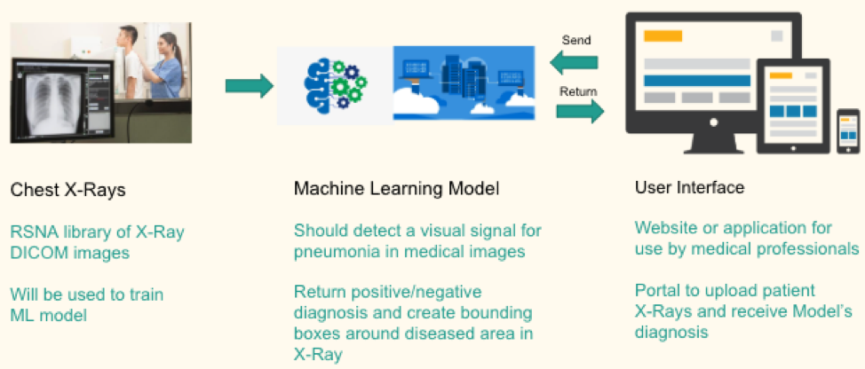

# ec601-project RSNA Pneumonia Detection
 
Kaggle link: https://www.kaggle.com/c/rsna-pneumonia-detection-challenge

Author: 
Min Zhou (minzhou@bu.edu), Andrew Stoycos (astoycos@bu.edu)

Project progress:
[Trello](https://trello.com/b/tm5CsmTN/sprint-1) 


# File Instruction:
* `working`  is the folder including a Jupyter Notebook for analyzing and processing our dataset.
* `app` folder is the web application of our product.
* `yolo_model` folder contains some model config files and a Jupyter Notebook used to train the model.
* `requirements.txt` contains some necessary python libraries to run our code.
* `MASKrcnn_model` contains the python code for Mask-RCNN model.
* `Lung_Segmentation` contains python code for segmenting lungs before training the Mask-RCNN model. 

# Product statement:

* Doctors, patients and medical professionals, need a product to help 
them to improve the efficiency and reach of diagnostic services. 

* This is an AI (machine learning/deep learning) model which can automatically detect a signal of pneumonia in medical images. 

* Current pneumonia diagnosis must be completed by a medical professional following a chest X-Ray and physical exam

* Our product will automate initial detection (imaging screening) of potential pneumonia cases and create bounding boxes around the areas of interest in order to prioritize and expedite their review. 


# MVP:

 - [x] [Medical image analysis and processing](https://github.com/minzhou1003/ec601-project/blob/master/data-analysis-of-rsna-library.ipynb).</li>
 - [x] A machine learning model that can predict pneumonia and return the result.
    <ul>
    <li>Pneumonia Positive</li>
    <li>Pneumonia Negative</li>
      <ul>Normal Negative</ul>
      <ul>Non-Normal Negative(other disease)</ul>
    </ul>
  - [x] [A website application to make the software accessible](https://github.com/minzhou1003/ec601-project/tree/master/app).


# System Diagram


# Data Source

- [The RSNA training dataset](https://www.kaggle.com/c/rsna-pneumonia-detection-challenge/data) is made up of 26684 chest radiographs in DICOM format can be download from kaggle. 
- This is a binary class data: 68% pneumonia negative and 32% pneumonia negative with bounding box labels.
- The resolution of raw image is 1024x1024.


# Machine Learning Model (Deep Learning)

1. ## [YOLO v3 Model](https://github.com/minzhou1003/ec601-project/tree/master/yolo_model)

[YOLO](https://pjreddie.com/darknet/yolo/) is an open source real-time object detection model. It has 106 layers and it's using localization, classificaiton, regression and Focal loss. The benifits of using YOLO v3 are listing below:

- Due to computational limitation, YOLO is fast and accurate for our problem.
- Easy to change the achitecture and parameters.
- There are a lot of resources to train and optimize the model.


2. ## [Mask-RCNN model](https://github.com/minzhou1003/ec601-project/tree/master/MASKrcnn_model)


# Sprints:

- [x] Sprint 1 (09/26/2018) 
- [x] Sprint 2 (10/17/2018)
- [x] Sprint 3 
- [x] Sprint 4

# To test the data anlysis part

## Installation:
- python 3
- Jupyter Notebook
- [virtualenv](https://cloud.google.com/python/setup)
* Note: All the code is tested on Linux 4.9.0-5-amd64 and NVIDIA Tesla K80 GPU. If you are trying to run it on Windows, you may need to use virtual machine.

### 1. Download this repository:
```
git clone https://github.com/minzhou1003/ec601-project.git
```

### 2. Set up and activate virtualenv inside that folder.
```
cd ec601-project
virtualenv --python python3 env
source env/bin/activate
```

### 3. Install python libraries:
```
pip install -r requirements.txt
```

### 4. Download the dataset
Download the [dataset](https://www.kaggle.com/c/rsna-pneumonia-detection-challenge/data) in the same directory of this project. You should get a folder called `input`.

### 5. Run the Jupyter Notebook
Go to the working directory and open your jupyter notebook:
```
cd working
jupyter notebook
```

# To run and check demo of our application:
See our [app instruction](https://github.com/minzhou1003/ec601-project/tree/master/app#web-application-for-pneumonia-detection).
