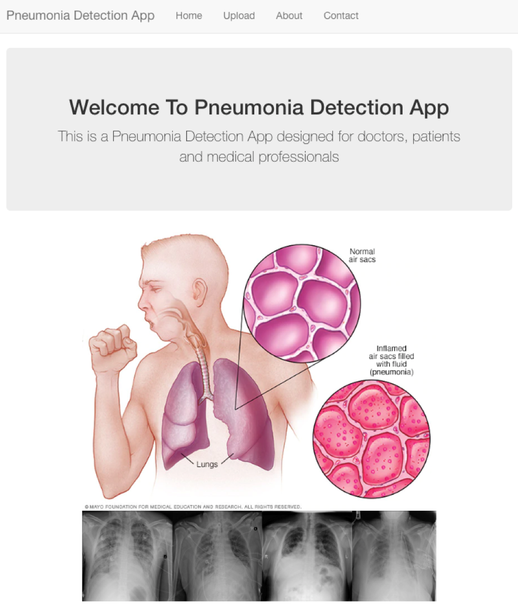
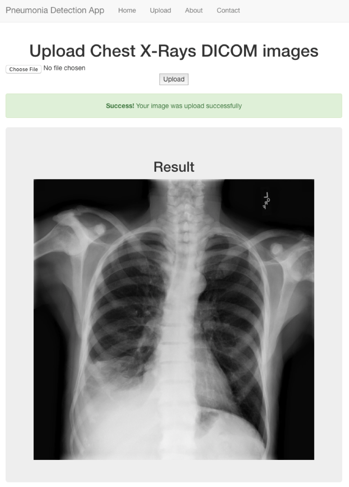
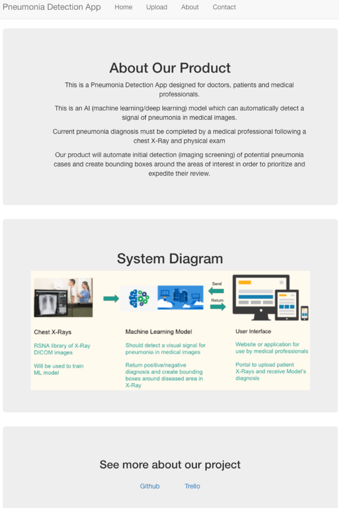
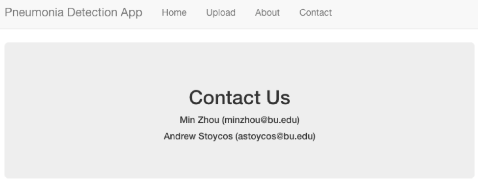

# Web Application for Pneumonia Detection

This is the web application develeped for our users using [Flask](http://flask.pocoo.org/).

# File Instruction:
* `app.py` is the python script to run this web application.
* `demo` folder contains the demo of this application.
* `setup_darknet.py` is python script to set up the trained YOLOv3 model.
* `static` folder contains images.
* `template` folder contains the html files.
* `uploads` folder stores user input images. 

# To run the code:

* Note: Please follow the first 3 steps of [this](https://github.com/minzhou1003/ec601-project#to-test-the-data-anlysis-part) first.

```
cd app
python setup.py
python app.py
```

# Demo photos of our app:







