# YOLO Model

This is the YOLOv3 model trained on RSNA library over 900 iterations.

# File Instruction:
* `cfg` folder contains all the config files.
* `demo_images` folder contains 6 groups of test image, label and prediction result for both positive and negative case.
* `metadata` folder contains training, test, validation text files for yolo model.
* `yolo_model_900.ipynb` is the Jupyter Notebook for developing this model over 900 training iterations.

# Training Loss:
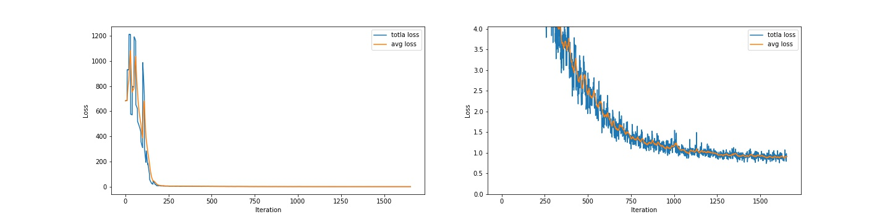

# Test example:
The ground truth image (left) and prediction (right) result with threshold = 0.05:

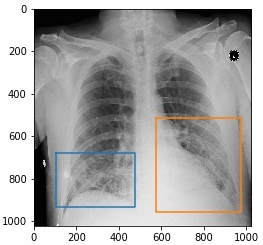 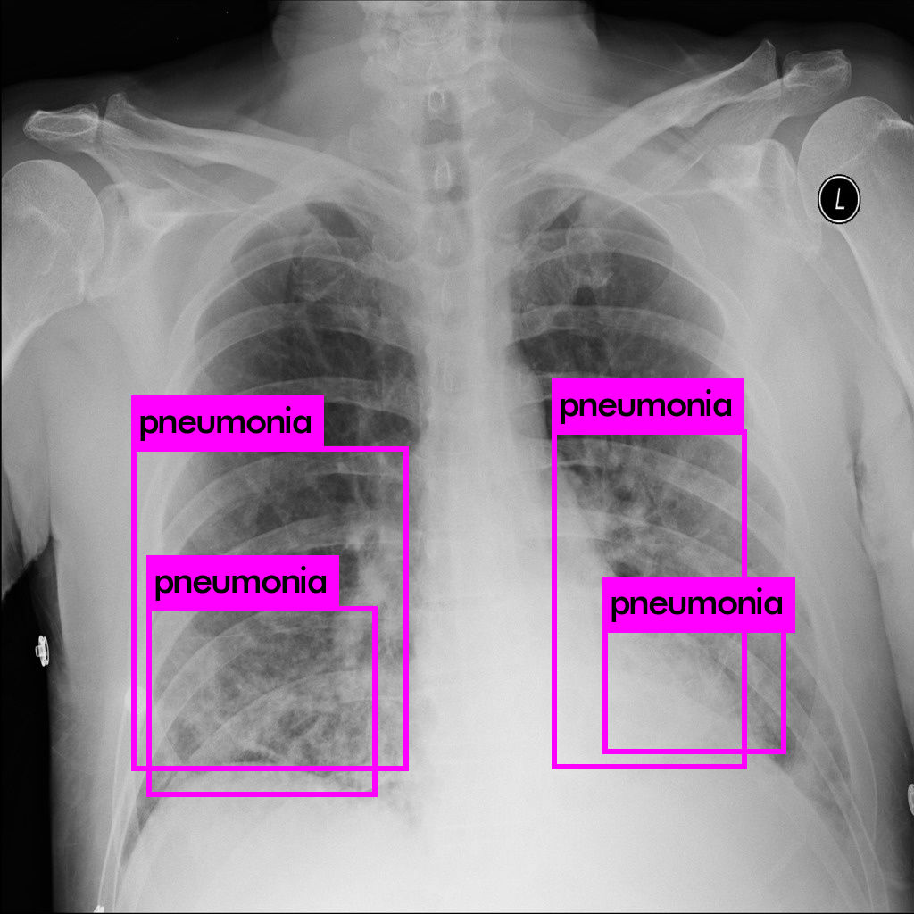 

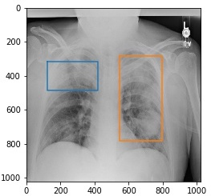 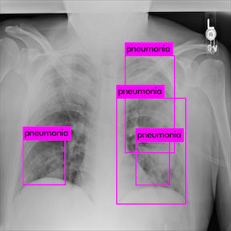 

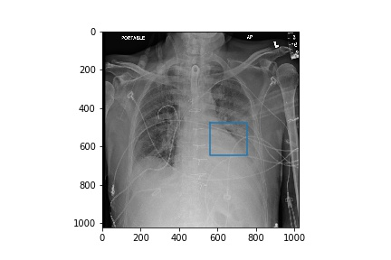 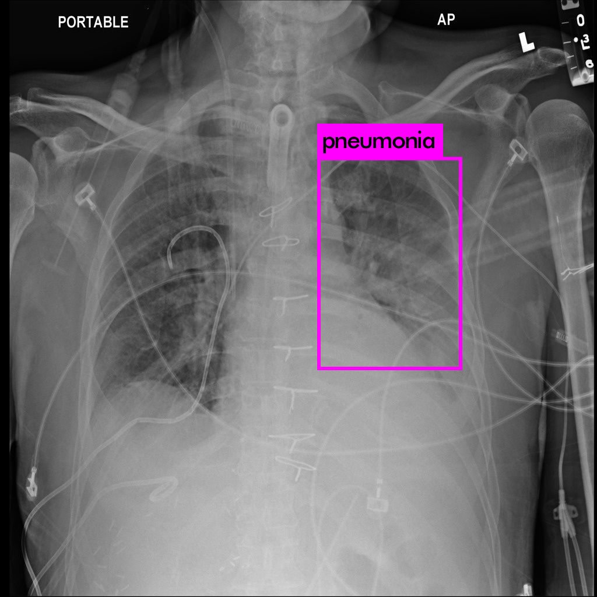 

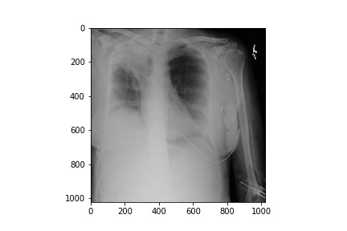 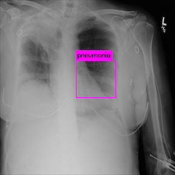 

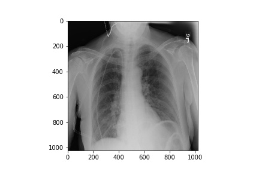 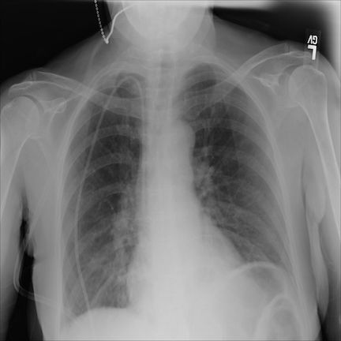 

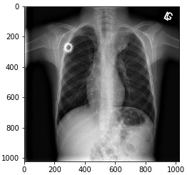 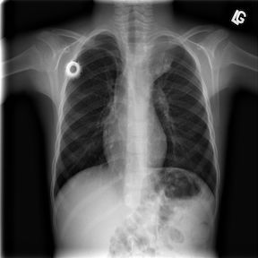 

As you can see, the result is getting better after training over 900 iteration using whole dataset, but we are still improving!

## Authors

* **Min Zhou** - minzhou@bu.edu

See also the list of [contributors](https://github.com/minzhou1003/ec601-project/graphs/contributors) who participated in this project.
