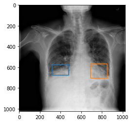
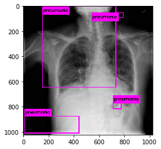

# YOLO Model

This is the YOLO model developed on a small dataset. A complete model is still training.

# File Instruction:
* `rsna_yolov3.cfg_test` is the config file for testing.
* `rsna_yolov3.cfg_train` is the config file for training.
* `rsna_yolov3_100.weights` is the model weights after 100 iteration.
* `rsna.data` is the file pointing to RSNA data path.
* `yolo_model.ipynb` if the Jupyter Notebook for developing this model.

# Test example
- The ground truth image and label:

- Prediction result:

As you can see, the result is not very good, but we are adding more data and training a more robust model.